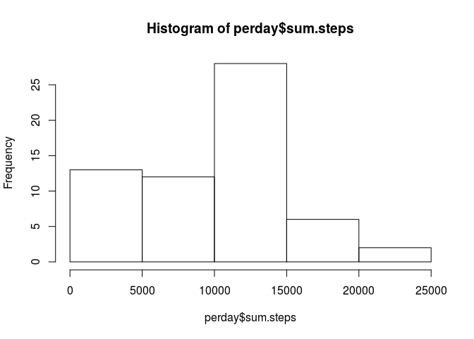
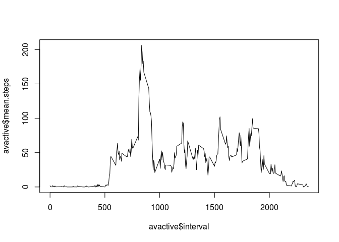
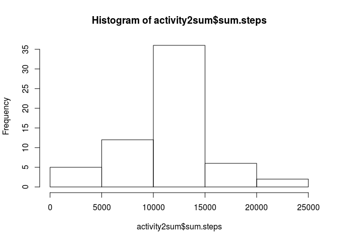
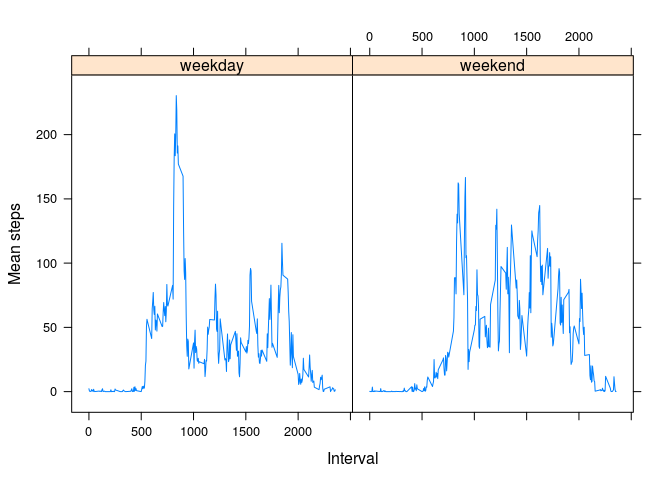

# PA1_template


## Loading and Preprocessing the Data

In this step I load the lattice package for future use and then I read in the data into a dataset. I also create two datasets: one that sums up steps by day and one that averages steps over each interval. 


```r
library(lattice)

activity <- read.csv("~/Coursera/Reproducible_Research/activity.csv")

perday <- aggregate(activity$steps, by = list(activity$date), FUN = sum, na.rm = TRUE)
names(perday) <- c("date", "sum.steps")

avactive <- aggregate(activity$steps, by = list(activity$interval), mean, na.rm = TRUE)
names(avactive) <- c("interval", "mean.steps")
```

## What is mean total number of steps taken per day?  
<br>

```r
hist(perday$sum.steps)
```

<!-- -->

```r
mean(perday$sum.steps)
```

```
## [1] 9354.23
```

```r
median(perday$sum.steps)
```

```
## [1] 10395
```

The mean number of steps per day is 9354.23 and the median number of steps per day is 10395.

## What is the average daily activity pattern?
<br>

```r
plot(avactive$mean.steps~avactive$interval, type="l")
```

<!-- -->

```r
avactive$interval[which.max(avactive$mean.steps)]
```

```
## [1] 835
```
The five minute interval with the most steps is 835.

## Imputing missing values

The total number of missing values is 2304.


```r
sum(is.na(activity$steps))
```

```
## [1] 2304
```

In order to accomodate for missing values I imputed the mean of each interval into each missing value. In order to accomplish this I merged two datasets: the original dataset and the dataset that has the mean number of steps for each interval. I then imputed the mean interval steps into any step value that was missing. The code that follows shows my process:


```r
activity2 <- merge(activity, avactive, by = "interval" )

for(i in 1:nrow(activity2)){
  if (is.na(activity2$steps[i])){ 
        activity2$steps[i] <- activity2$mean.steps[i]
  }
}
```

Below is a figure that includes imputed values for the number of steps taken per day:


```r
activity2sum <- aggregate(activity2$steps, by = list(activity2$date), FUN = sum)
names(activity2sum) <- c("date", "sum.steps")

hist(activity2sum$sum.steps)
```

<!-- -->

```r
options (scipen = 999)
```

The mean number of steps taken each day is 10766.19 and the median is 10766.19.


```r
mean(activity2sum$sum.steps)
```

```
## [1] 10766.19
```

```r
median(activity2sum$sum.steps)
```

```
## [1] 10766.19
```

With the imputed values, the mean and median steps per day increased. Interestingly, the mean and median are equal. 

## Are there differences in activity patterns between weekdays and weekends?

For the first part of this step I created a variable called 'day' that indicates whether the observation occured on a weekday or weekend.


```r
activity2$date <- as.Date(activity2$date)

for (i in 1:nrow(activity2)){
    if (weekdays(activity2$date[i]) %in% c("Saturday", "Sunday")){
      activity2$day[i] <- "weekend"
    } else {
      activity2$day[i] <- "weekday"
    }
}
```

I then created a plot of the average number of steps taken during each interval by the value of the 'day' variable. 


```r
acttime <- aggregate(activity2$steps, by = list(activity2$interval, activity2$day), FUN = mean)

xyplot(acttime$x ~ acttime$Group.1 | acttime$Group.2, data = acttime, type = "l", xlab = "Interval", ylab = "Mean steps")
```

<!-- -->
